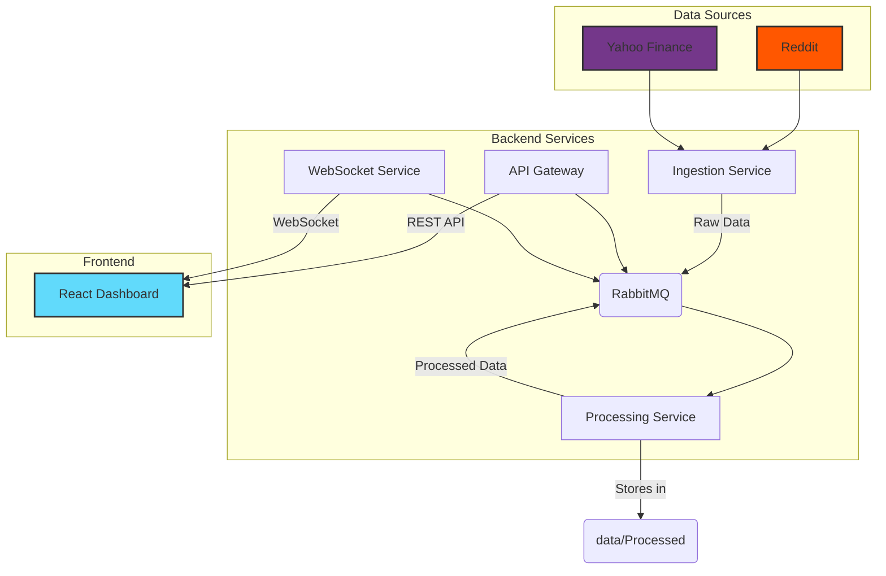

# CryptoVibe: Cryptocurrency Sentiment Analysis Platform

[](https://www.repostatus.org/#active)


CryptoVibe is a comprehensive platform for real-time cryptocurrency sentiment analysis and market data visualization. It ingests data from social media platforms like Reddit and financial sources, processes it through a sophisticated NLP pipeline, and presents the insights in an interactive web-based dashboard.

## Overview

The project aims to uncover the correlation between public sentiment on social media and cryptocurrency price movements. By scraping, processing, and analyzing vast amounts of data, CryptoVibe provides a real-time pulse of the market, helping users identify trends, detect significant events, and understand the sentiment driving different cryptocurrencies.

## Key Features

- **Real-time Data Ingestion:** Scrapes data from Reddit (via Praw) and financial data from Yahoo Finance (via yfinance).
- **Microservices Architecture:** A resilient and scalable backend built with Docker and RabbitMQ for message passing between services.
- **Advanced Sentiment Analysis:** Utilizes a multi-faceted approach to sentiment analysis, including VADER, and transformer-based models (like FinBERT).
- **Event Detection:** Identifies significant market or news events from text data.
- **Interactive Dashboard:** A modern, responsive frontend built with React, TypeScript, and Vite, featuring:
  - Real-time sentiment timelines.
  - Price and sentiment correlation charts.
  - Data breakdowns by cryptocurrency.
  - Word clouds for popular topics.
- **Data Processing Pipeline:** Follows a Medallion architecture (Bronze -> Silver -> Gold) for progressively cleaning and enriching data.

## Architecture

CryptoVibe uses a microservices architecture orchestrated by Docker Compose. Data flows from ingestion services through a message queue to processing services, and is then made available to the frontend via an API Gateway and WebSocket for real-time updates.



## Tech Stack

| Component            | Technology                                                                                             |
| -------------------- | ------------------------------------------------------------------------------------------------------ |
| **Frontend**         | [React](https://react.dev/), [TypeScript](https://www.typescriptlang.org/), [Vite](https://vitejs.dev/), [Tailwind CSS](https://tailwindcss.com/), [Recharts](https://recharts.org/) |
| **Backend**          | [Python 3](https://www.python.org/), [FastAPI](https://fastapi.tiangolo.com/), [WebSockets](https://fastapi.tiangolo.com/advanced/websockets/) |
| **Data Processing**  | [Pandas](https://pandas.pydata.org/), [NumPy](https://numpy.org/), [NLTK](https://www.nltk.org/), [spaCy](https://spacy.io/), [Transformers](https://huggingface.co/docs/transformers/index) |
| **Sentiment Models** | [VADER](https://github.com/cjhutto/vaderSentiment), FinBERT                                           |
| **Infrastructure**   | [Docker](https://www.docker.com/), [Docker Compose](https://docs.docker.com/compose/)                  |
| **Message Broker**   | [RabbitMQ](https://www.rabbitmq.com/)                                                                  |
| **Data Sources**     | [Reddit (PRAW)](https://praw.readthedocs.io/en/latest/), [yfinance](https://pypi.org/project/yfinance/) |


## Installation and Setup

### Prerequisites

- [Docker](https://docs.docker.com/get-docker/) and [Docker Compose](https://docs.docker.com/compose/install/)
- [Node.js](https://nodejs.org/en) (v18+ for the dashboard)
- [Python 3](https://www.python.org/downloads/)

### Configuration

The project uses a `.env` file for configuration. Create a `.env` file in the root of the project:

```bash
touch .env
```

Add the necessary environment variables. The backend services require API credentials for the data sources, and the services need to know how to connect to RabbitMQ.

```env
# .env file

# RabbitMQ Configuration (Defaults are usually fine for local)
RABBITMQ_HOST=rabbitmq
PROCESSED_POSTS_QUEUE=processed_reddit_posts

# Reddit API Credentials (Required for ingestion_service)
REDDIT_CLIENT_ID="your_reddit_client_id"
REDDIT_CLIENT_SECRET="your_reddit_client_secret"
REDDIT_USER_AGENT="your_reddit_user_agent"

# Add other API keys or config as needed
```

## How to Run the Project

The entire application stack can be run using Docker Compose.

1.  **Build and Start Services:**
    From the root directory, run:

    ```bash
    docker-compose up --build
    ```

    This command will:
    - Build the Docker images for all services, including the dashboard.
    - Start all the containers.
    - Begin the data ingestion and processing pipeline.

2.  **Access the Dashboard:**
    Once the containers are running, open your web browser and navigate to:

    **http://localhost:5173**

3.  **Access the API:**
    The API Gateway is available at:

    **http://localhost:8000/docs**

### Development Mode

If you want to run the frontend dashboard in development mode for hot-reloading:

1.  **Navigate to the dashboard directory:**
    ```bash
    cd dashboard
    ```

2.  **Install dependencies:**
    ```bash
    npm install
    ```

3.  **Start the dev server:**
    ```bash
    npm run dev
    ```

    The dashboard will be available at **http://localhost:5173**. Ensure the backend services from `docker-compose` are running so the dashboard can connect to the API and WebSocket.

## API Documentation

The API is served by the `api_gateway` service and is documented using Swagger UI.

-   **API Base URL:** `http://localhost:8000`
-   **Swagger Docs:** `http://localhost:8000/docs`

### Key Endpoints

-   `GET /health`: Health check for the API gateway.
-   `GET /sentiment/timeline`: Returns the accumulated processed sentiment data.

The dashboard also receives real-time updates via a WebSocket connection to `ws://localhost:8001`.

## Folder Structure

```
├── dashboard/         # React/Vite frontend application
│   ├── src/
│   ├── components/    # React components
│   └── vite.config.ts # Vite configuration
├── data/              # Datasets (Bronze, Silver, Gold), visualizations
│   ├── Bronze/        # Raw, unconsolidated data
│   ├── Silver/        # Cleaned data
│   └── Gold/          # Enriched, analysis-ready data
├── legacy_pipeline/   # Older, script-based data processing pipeline
├── services/          # Backend microservices
│   ├── api_gateway/   # FastAPI gateway for the frontend
│   ├── ingestion_service/ # Scrapes data from external sources
│   ├── processing_service/ # Performs NLP and sentiment analysis
│   └── websocket_service/ # Handles real-time communication
├── .env               # Environment variables (needs to be created)
├── docker-compose.yml # Docker Compose orchestration file
└── Requirements.txt   # Python dependencies
```

## Troubleshooting

-   **Data not appearing on dashboard:**
    -   Ensure your `.env` file is correctly populated with API keys for Reddit.
    -   Check the logs of the `ingestion_service` and `processing_service` for errors: `docker-compose logs ingestion_service`.
    -   The `api_gateway` stores data in-memory. If you restart the container, the data will be cleared until new data is processed.
-   **Connection Refused Errors:**
    -   Give the services, especially RabbitMQ, a moment to initialize before they can accept connections.
    -   Ensure Docker is running correctly and the container network is up.

## Contribution Guidelines

We welcome contributions! Please follow these steps:

1.  **Fork** the repository.
2.  Create a new **branch** (`git checkout -b feature/your-feature-name`).
3.  Make your changes.
4.  **Commit** your changes (`git commit -m 'Add some feature'`).
5.  **Push** to the branch (`git push origin feature/your-feature-name`).
6.  Open a **Pull Request**.

## License

This project is not currently licensed.
