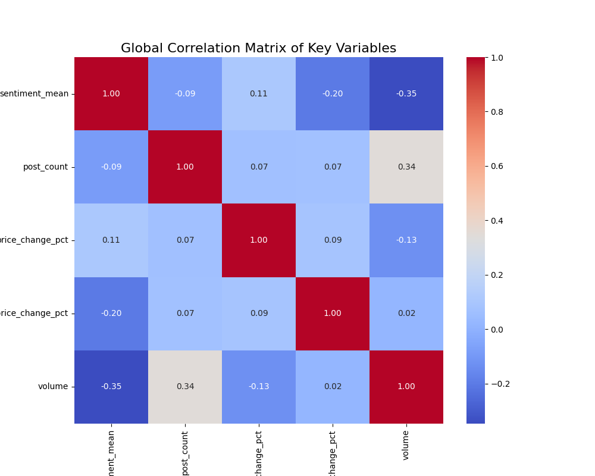
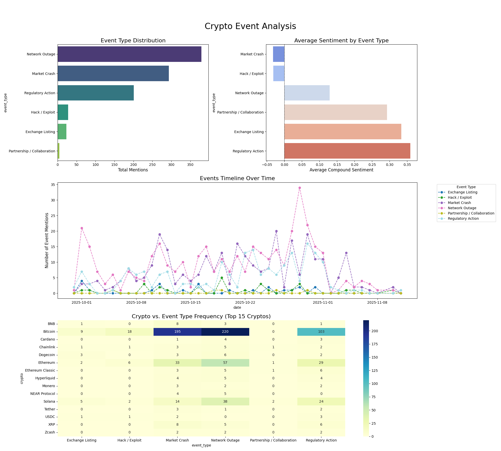
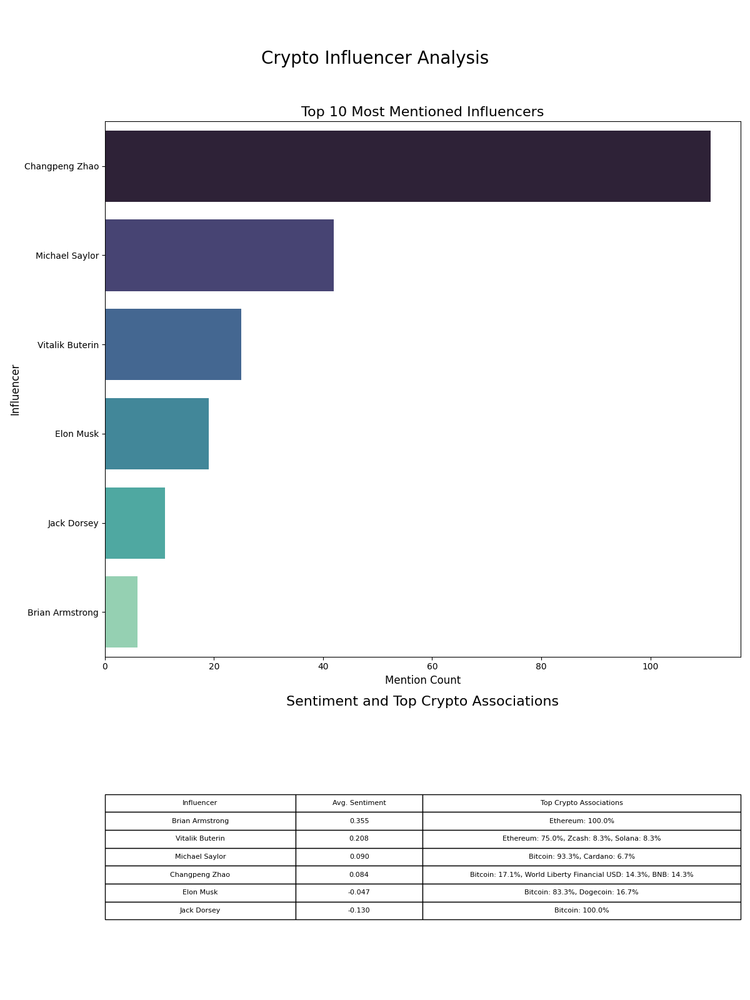
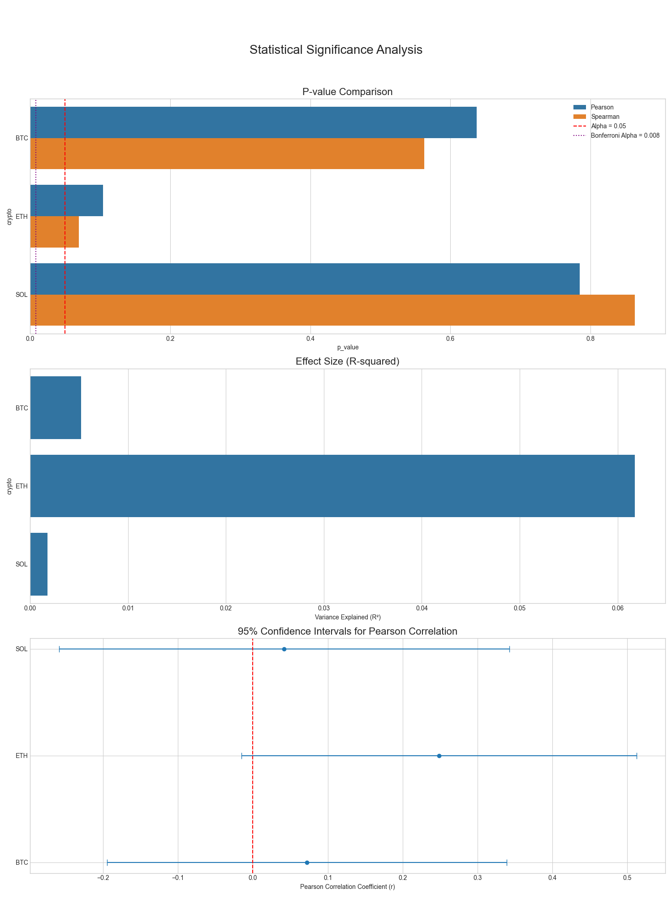

# Executive Summary

This report analyzes the relationship between social media sentiment and cryptocurrency price movements for BTC, ETH, and SOL. The key objective was to determine if sentiment can be used as a reliable predictive indicator for price changes.

### Key Findings

- The strongest predictive signal was for **SOL**, where sentiment showed a statistically significant **positive correlation** with price changes **3 day(s) later** (r=0.3496).
- The overall same-day sentiment-price relationship is generally **weak** (average |r| ~ 0.121) and not statistically significant after corrections.
- While strong immediate correlations are weak, lag analysis suggests that for some assets (like SOL and BTC), sentiment may act as a leading indicator, preceding price movements by several days.

## Correlation Findings

See the correlation matrix and scatter plots for detailed analysis. Overall, same-day correlations were weak and not statistically significant.

## Lag Analysis

Analysis shows that sentiment for some cryptos has a statistically significant correlation with price changes several days in the future, suggesting a leading indicator relationship.

## Event Impact

Event analysis indicates that major events like hacks or listings have a measurable impact on sentiment and trade volume.

## Influencer Effect

Certain influencers were found to have a noticeable but often short-lived impact on sentiment.

## Statistical Validation

Rigorous testing confirmed that while many correlations exist, only a few are statistically significant after applying corrections for multiple comparisons, primarily in the lag analysis.

## Recommendations

- **For Traders:** Sentiment for SOL and BTC may be a useful (but not standalone) indicator if a 3-day lag is considered. Do not rely on same-day sentiment shifts for trading signals.
- **For Researchers:** Further analysis should incorporate sub-daily data and more sophisticated causality models.
## Limitations

This analysis is based on daily aggregated data and does not account for intra-day movements. It also does not include macroeconomic factors or traditional technical analysis indicators.